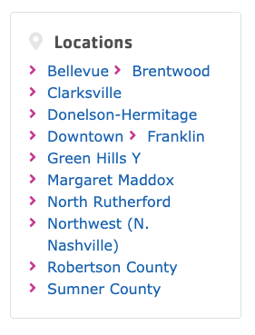
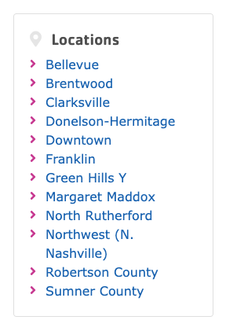
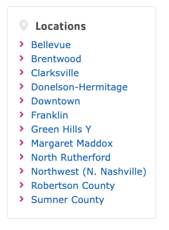

# Digital Content Specialist Submission

This page highlights web content and email marketing experience for a Digital Content Specialist role, focusing on relevant technical and strategic skills.

  I’ve included a real-world example of how I can support the YMCA’s goal of effective online communication with the community — a UX improvement that can be applied to the news pages of the website.

<h2>YMCA Locations Sidebar UX Fix</h2>

  During my interview preparation, I identified and tested a layout improvement for the
  <a href="https://www.ymcamidtn.org/news/what-we-mean-when-we-say-we-are-open" target="_blank" rel="noopener noreferrer">
    YMCA of Middle Tennessee website
  </a>.
  The issue appeared in the sidebar of that news page, where location links were wrapping awkwardly. I traced the styles to
  the <code>_news.scss</code> file, specifically the
  <code>.arrow-list a</code> CSS selector. By updating <code>display: inline-block</code> to <code>display: block</code>,
  and later adding <code>white-space: nowrap</code>, I improved both layout flow and readability.

  

    
    
Original layout – wrapping issue

  

  

    
    
Using <code>display: block</code> to fix vertical flow

  

  

    
    
Adding <code>white-space: nowrap</code> to prevent awkward breaks

  

---

## Web Content & Site Management Experience

I work daily in WordPress and occasionally in other platforms like Joomla and Shopify. My Joomla work focuses mainly on migrating sites into WordPress for its wider theme options, stronger plugin support, and more active development. For Shopify, I handle integration with WordPress and store migrations to WooCommerce.

In WordPress, I work with a wide variety of themes, page builders, plugins, and third-party tools to support flexible layouts, structured content, and advanced functionality. I also customize themes and plugins, and build custom plugins as needed.

### Examples of Work

- **Event & Calendar Management**  
  Configured and customized event/class calendars for <a href="https://lebanonwilsonchamber.com/events/" target="_blank" rel="noopener"><strong>Lebanon Wilson Chamber</strong></a>, <a href="https://visitwilsoncounty.com/" target="_blank" rel="noopener"><strong>Visit Wilson County</strong></a>, and <a href="https://sunshineweaving.com/calendar/" target="_blank" rel="noopener"><strong>Sunshine Weaving</strong></a>.

- **End-to-End Site Builds**  
  Designed and developed solo projects including <a href="https://careweare.com" target="_blank" rel="noopener"><strong>Care We Are</strong></a> (including targeted keyword research and on-page SEO optimization using Semrush and Yoast SEO) and <a href="https://elrodstudwelding.com" target="_blank" rel="noopener"><strong>Elrod Stud Welding</strong></a>.

- **Custom Development**  
  Extended design and functionality through custom themes and plugins for sites such as <a href="https://philprint.com" target="_blank" rel="noopener"><strong>PhilPrint</strong></a>, <a href="https://firstfreedombank.com" target="_blank" rel="noopener"><strong>First Freedom Bank</strong></a>, <a href="https://midsouthcolor.com/" target="_blank" rel="noopener"><strong>Mid-South Color Labs</strong></a>, and <a href="https://plannwell.com/" target="_blank" rel="noopener"><strong>Plann Well</strong></a> to meet specific business and usability needs.

- **Platform Migrations**  
  Migrated sites from Joomla to WordPress for <a href="https://ucemc.com" target="_blank" rel="noopener noreferrer"><strong>UCEMC</strong></a> and <a href="https://cedarstonebank.com" target="_blank" rel="noopener noreferrer"><strong>CedarStone Bank</strong></a>, involving content restructuring, theme redevelopment, and SEO preservation.

I’m comfortable working with any platform and always ready to learn something new when the job calls for it.

---

## Email Marketing Experience

I regularly support email marketing as part of broader digital strategies, especially where websites, forms, CRMs, and campaign data intersect. I’ve designed and adapted responsive email templates in Mailchimp and connected forms to platforms like Mailchimp and Zoho, using tools such as Zapier or native integrations to automate workflows and reduce manual data handling.

In addition to technical setup, I support campaign tracking and reporting through Bit.ly and Google Analytics, helping teams monitor link performance, email engagement, and user behavior across platforms. I also configure UTM parameters to ensure accurate source tracking and reporting in GA.

For the past three years, I’ve served as technical lead for the <a href="https://tnstateparksconservancy.org/my-tn-state-park-fundraiser/" target="_blank" rel="noopener"><strong>Tennessee State Parks Conservancy fundraiser</strong></a>. I’ve managed the backend setup for their multi-platform campaign; integrating Mailchimp, Kindful, Bloomerang, and Zapier to ensure donor activity triggers targeted email sequences. I’ve also supported campaign link tracking using Bit.ly and configured UTM parameters for Google Analytics to monitor and report on traffic sources, user behavior, and conversions.
